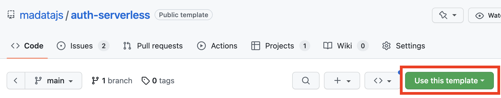

# Authentication

## API

```ts
interface UserInfo {
	username: string;
	name?: string;
	avatar?: string;
	url?: string;
	[other: string]: any;
}

async login(options?: {passive?: boolean}) : Promise<UserInfo>;
async logout() : Promise<void>;
user: UserInfo | null;
```

`backend.login()` will display authentication UI to the user.
`backend.login({passive: true})`
will log the user in if they have already logged in previously,
but will not do anything if they have not.
If `backend.login()` results to an actual login,
it resolves to an object with information about the user,
which is also available under `backend.user`

`backend.user` contains various user information, as returned by the backend.
The following are normalized across backends:
- `backend.user.username`
- `backend.user.name`
- `backend.user.avatar`
- `backend.user.url` (profile URL in remote service)

Do note that not all are guaranteed to be available.
E.g. in backends that don’t support avatars, `backend.user.avatar` will be `undefined`.

`backend.logout()` will log the current user out.

If user already has an access token, they will be logged in at the time the `Backend` instance is created (usually through `Backend.from()`),
as the `Backend` constructor calls `backend.login({passive: true})`.

`Backend` objects are also event targets, and fire `mv-login` and `mv-logout` events.

## Examples

Assuming there is relevant CSS that toggles the visibility of certain elements based on the presence of the `logged-in` class on the `header` element,
you could show auth status to the current user like:

```js
backend.addEventListener("mv-login", evt => {
	header.classList.add("logged-in");

	let {username, avatar} = backend.user;
	my_username.textContent = username;
	my_avatar.src = avatar;
});

backend.addEventListener("mv-logout", evt => {
	// Hide user-related UI
	header.classList.remove("logged-in");
});
```

To have buttons for login/logout:

```js
loginButton.addEventListener("click", evt => backend.login());
logoutButton.addEventListener("click", evt => backend.logout());
```

## Decentralized OAuth Authentication Providers

Backends that support authentication fall in two main categories:
(a) [OAuth](https://en.wikipedia.org/wiki/OAuth) backends
(b) backends doing their own authentication.

For (a), Madata introduces the concept of a *decentralized auth(entication) provider*,
so you can experiment with different backends without having to register an OAuth application with each of those services.
Instead, the auth provider has registered an OAuth app for all the backends it supports,
facilitates the OAuth handshake for you, and communicates the access token back to Madata so it can store it in the user's browser.

The whole purpose of the auth provider is to handle acquiring the initial access token for a user's first login.
After that, the access token is cached in the browser’s `localStorage` until it expires, usually not for months or even years,
and the user doesn’t need to make any further requests to the auth provider.
For this reason, the bandwidth and CPU requirements for hosting an auth provider are very low,
even if it serves thousands of users.

You can choose an existing open authentication server, or [self-host your own](/docs/advanced/).

Here are some open authentication servers you can use:
- [`https://auth.madata.dev`](https://auth.madata.dev)
- [`https://auth.mavo.io`](https://auth.mavo.io)

Each auth server supports certain backends and may not support the full range of backends Madata supports.
Visiting the server's homepage should tell you which backends it supports.
You could also programmatically fetch `{{ auth_server_url }}/services.json` to programmatically read which services are supported.

<div class=warning>

Make sure you choose an auth provider you trust.
A malicious auth provider could steal your users' access tokens and use them to impersonate them or corrupt their data.

</div>

## Choosing an auth provider

The default auth provider is `https://auth.madata.dev` but you can customize it like so:

```js
Backend.authProvider = "https://auth.example.com";
```

This sets the default auth provider to `"https://auth.example.com"`.
You would need to do this before creating any `Backend` objects.

<h2 id="custom-auth-provider">Advanced: Creating your own auth provider</h2>

1. First, use one of the template repos.
We provide template repos for the following tech stacks:
	1. Serverless (Netlify, but can easily be adjusted for other providers): [madatajs/auth-serverless](https://github.com/madatajs/auth-serverless)
	2. PHP: [madatajs/auth-php](https://github.com/madatajs/auth-php)



2. On the template repo of your choice, click "Use this template" and then "Create new Repository".
3. **Make your new repo private.** This is essential, since you will be storing secret API keys in it!
4. In your local clone of the repo, run `npm run init-repo` and then `npm run update-repo` to link your new repo to the template repo so you can pull in updates.
Then, every time you want to pull in updates from the original template repo, you just run `npm run update-repo`.
6. Register OAuth applications for each service you wish to support.
Edit `services.json` with the public API keys of these applications.
Copy `secret.json`, rename it `.secret.json` and edit it with the secret API keys of these services.

That's it, you’re done! Don’t forget to set up a Netlify (or whatever provider you are using)
website to deploy from your newly created repo!

<div class=warning>

We strongly recommend leaving the confirmation step in place (*“Are you sure you want to log in to [URL]?”*).
Since all Madata apps using the same auth provider share the same API keys,
without this confirmation step, someone could trick users who have ever authenticated with a particular auth provider
into logging in to a malicious app, without their intervention.

</div>

<div class=warning>

Please note you need to run your auth provider on the root of a domain or subdomain.
E.g. `https://example.com/foo` is not a valid auth provider URL, but `https://foo.example.com` is.

</div>